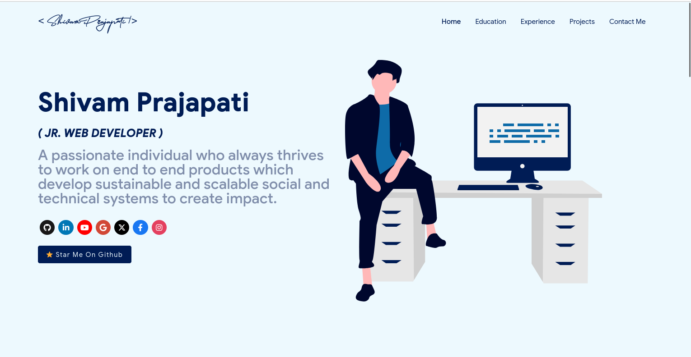

<p align="center"> 
    </img>
</p>
<p align="center"> 
    </img>
</p>
# Sections 📚

✔️ Summary and About me\
✔️ Skills \
✔️ Open Source Projects Connected with Github\
✔️ Experience\
✔️ Certifications 🏆\
✔️ Blogs\
✔️ Education\
✔️ Contact me

To view a live example, **[click here](https://ashutosh1919.github.io/)**

# Clone and Use 📋

- The website is completely built on `react-js` library of `javascript` and that's why we need `nodejs` and `npm` installed
- While installing `nodejs` and `npm`, try to install versions which are equal or greater than the versions mentioned in badges above
- In case you want to help developing it or simply saving it, you can fork the repository just by clicking the button on the top-right corner of this page
- After the successful installation of `nodejs` and `npm`, clone the repository into your local system using below command:
  ```bash
   git clone https://github.com/ashutosh1919/masterPortfolio.git
  ```
  This will clone the whole repository in your system.
- To download required dependencies to your system, navigate to the directory where the cloned repository resides and execute following command:
  ```node
  npm install
  ```
- Now the project is ready to use
- You can check it using `npm start`, it will open the website locally on your browser.

# Customize it to make your own portfolio ✏️

In this project, there are basically 4 things that you need to change to customize this to anyone else's portfolio: **package.json**, **Personal Information**, **Github Information** and **Splash Logo**.

### package.json

Open this file, which is in the main cloned directory, choose any "name" and change "homepage " to `https://<your-github-username>.github.io`. Do not forget the `https://`, otherwise fonts will not load.

### Personal Information

You will find `src/portfolio.js` file which contains the complete information about the user. The file looks something like below:

```javascript
// Home Page
const greeting = {
    ...
}

// Social Media
const socialMediaLinks = {
    ...
}

...
```

You can change the personal information, experience, education, social media, certifications, blog information, contact information etc. in `src/portfolio.js` to directly reflect them in portfolio website.

### How to change the icons on homepage under what i do section?

1. This section pulls data from `skills` in portfolio.js file.
2. Visit this website:fontawesome
3. Search for the skill you are looking to add.
4. Select the icon of your choice.
5. Copy the text beside **Selected Icon** and replace it with `fontAwesomeClassName` of that particular softwareSkill.

#### How to use custom images instead of Iconify Icons?

1. Add a valid image file into the `public/skills` folder
2. Insert the image name into the `imageSrc` attribute of the particular softwareSkill
3. Remove the `fontAwesomeClassName` property or leave it empty because it takes precedence over `imageSrc`
4. Add custom styling to the `img` using the `style` Property
